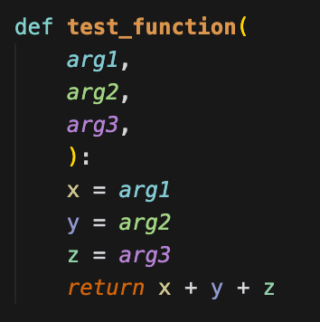
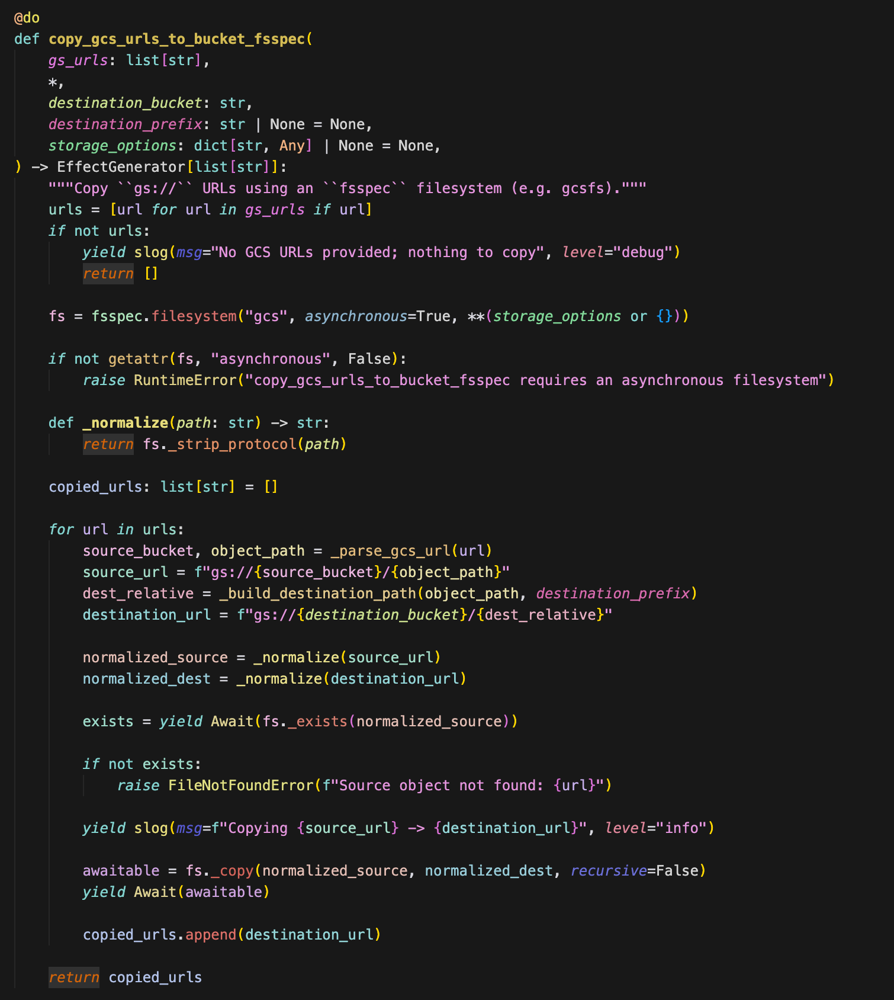
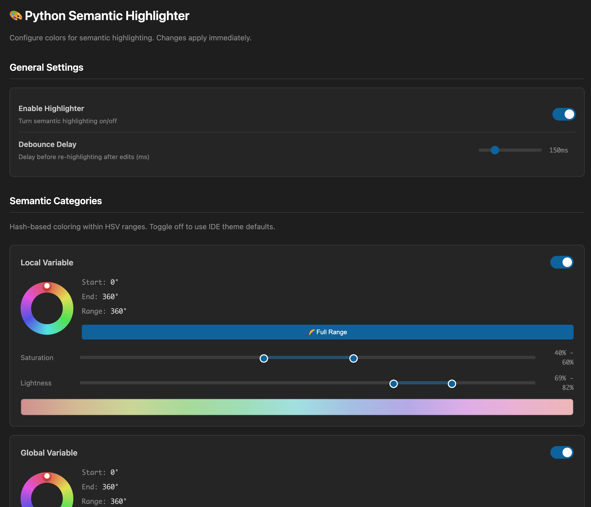

# VS Code Python Semantic Highlighting

[](https://github.com/proboscis/vscode-semantic-highlighting/releases/latest)
[](https://opensource.org/licenses/MIT)

IntelliJ-style semantic highlighting for Python in VS Code. Each symbol gets a unique color based on its name, making it easy to track variables and understand code at a glance.



## ✨ Features

- **Unique colors for each symbol** — Same variable = same color throughout the file
- **Smart color distribution** — Adjacent variables get maximally different colors
- **Per-category customization** — Configure colors for variables, parameters, functions, classes, etc.
- **Visual settings panel** — Circular hue picker and HSV sliders
- **Jupyter notebook support** — Works with `.ipynb` files and magic commands
- **Fast Rust parser** — Sub-millisecond parsing using `rustpython-parser`



### Settings Panel



**👉 For full user documentation, see [extension/README.md](extension/README.md)**

## 📦 Installation

### Download from GitHub Releases
1. Go to the [Latest Release](https://github.com/proboscis/vscode-semantic-highlighting/releases/latest)
2. Download `python-semantic-highlighter-x.x.x.vsix`
3. In VS Code: `Cmd+Shift+P` / `Ctrl+Shift+P` → `Extensions: Install from VSIX...`
4. Select the downloaded file

**Or install from command line:**
```bash
# Download the latest release
curl -L -o extension.vsix $(curl -s https://api.github.com/repos/proboscis/vscode-semantic-highlighting/releases/latest | grep browser_download_url | cut -d '"' -f 4)

# Install
code --install-extension extension.vsix
```

### Supported Platforms
| Platform | Architecture |
|----------|--------------|
| macOS | Apple Silicon (arm64), Intel (x64) |
| Linux | x64, arm64 |
| Windows | x64 |

## Project Structure

```
vscode-semantic-highlighting/
├── extension/                    # VS Code Extension (TypeScript)
│   ├── src/
│   │   ├── extension.ts          # Main entry point
│   │   ├── highlighter.ts        # Rust binary invocation
│   │   ├── colors.ts             # Color generation (Van der Corput)
│   │   └── settingsPanel.ts      # WebView settings UI
│   ├── bin/                      # Pre-built Rust binary
│   ├── package.json              # Extension manifest
│   └── README.md                 # User documentation
│
├── rust-highlighter/             # Rust AST Parser
│   ├── src/
│   │   └── main.rs               # Symbol extraction from Python AST
│   └── Cargo.toml                # Rust dependencies
│
└── README.md                     # This file (developer docs)
```

## Development Setup

### Prerequisites

- Node.js 18+
- Rust toolchain (`rustup`)
- VS Code 1.85+

### Building (Current Platform)

```bash
# Clone repository
git clone https://github.com/proboscis/vscode-semantic-highlighting.git
cd vscode-semantic-highlighting

# Build Rust highlighter
cd rust-highlighter
cargo build --release

# Copy binary to extension
mkdir -p ../extension/bin
cp target/release/python-semantic-highlighter ../extension/bin/

# Install extension dependencies
cd ../extension
npm install

# Build TypeScript
npm run build
```

### Building for Multiple Platforms

The extension supports:
- **macOS** (Apple Silicon & Intel)
- **Linux** (x64 & ARM64)
- **Windows** (x64)

#### Using GitHub Actions (Recommended)

Push a tag to trigger automatic builds for all platforms:
```bash
git tag v1.4.0
git push origin v1.4.0
```

#### Manual Cross-Compilation

```bash
# Install cross for cross-compilation
cargo install cross

# Run build script
chmod +x scripts/build-all-platforms.sh
./scripts/build-all-platforms.sh
```

The binaries will be placed in `extension/bin/{platform}/`:
- `darwin-arm64/` - macOS Apple Silicon
- `darwin-x64/` - macOS Intel
- `linux-x64/` - Linux x64
- `linux-arm64/` - Linux ARM64
- `win32-x64/` - Windows x64

### Running in Development

1. Open the project in VS Code
2. Press `F5` to launch Extension Development Host
3. Open a Python file in the new window

### Testing Rust Parser

```bash
cd rust-highlighter
cargo test

# Manual testing
echo 'def hello(x): return x + 1' | ./target/release/python-semantic-highlighter /dev/stdin
```

### Packaging

```bash
cd extension
npm run package
# Creates python-semantic-highlighter-x.x.x.vsix
```

## Architecture

### Rust Highlighter

Parses Python using `rustpython-parser` and extracts:
- Symbol names and positions (line, column, length)
- Symbol types (variable, function, class, parameter, attribute, keyword, decorator, type_annotation, kwarg_name)
- Handles Jupyter/IPython magic commands

Output format:
```json
{
  "symbols": [
    {
      "name": "my_variable",
      "kind": "variable",
      "occurrences": [
        {"line": 0, "column": 0, "length": 11}
      ]
    }
  ]
}
```

### Color Generation

Uses **Van der Corput sequence** for maximum color separation:
1. Each new symbol gets an index
2. Index is converted to a value between 0-1 using binary subdivision
3. Value is mapped to the configured hue range
4. Results in maximally distant colors for sequential symbols

### VS Code Integration

- Invokes Rust binary as subprocess
- Parses JSON output
- Creates `TextEditorDecorationType` for each unique color
- Applies decorations to all visible editors
- Handles configuration changes, file saves, and editor switches

## Publishing

### Prerequisites

1. [Create a Personal Access Token](https://code.visualstudio.com/api/working-with-extensions/publishing-extension#get-a-personal-access-token) on Azure DevOps
2. Install vsce: `npm install -g @vscode/vsce`

### Publish Steps

```bash
cd extension

# Login (first time only)
vsce login proboscis

# Publish
vsce publish

# Or publish with version bump
vsce publish patch  # 0.10.0 -> 0.10.1
vsce publish minor  # 0.10.0 -> 0.11.0
vsce publish major  # 0.10.0 -> 1.0.0
```

## Contributing

1. Fork the repository
2. Create a feature branch (`git checkout -b feature/amazing-feature`)
3. Make your changes
4. Run tests (`cargo test` in rust-highlighter)
5. Commit (`git commit -m 'Add amazing feature'`)
6. Push (`git push origin feature/amazing-feature`)
7. Open a Pull Request

## License

MIT License - see [LICENSE](extension/LICENSE) for details.
